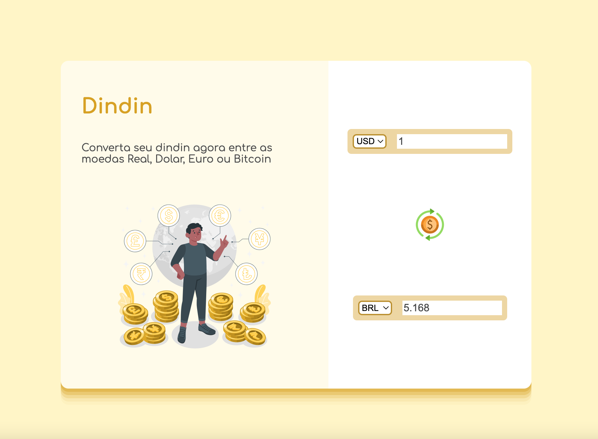

# Dindin Conversor de Moedas
Repositório destinado a um projeto de conversor de moedas que faz consulta de cotação via AwesomeAPI e calcula a conversão do valor digitado.

## Moedas com conversão:
- BRL (Real Brasileiro)
- USD (Dolar Americano)
- EUR (Euro)
- BTC (Bitcoin)

## Feito com:
- HTML
- CSS
- JavaScript
- Fetch API

